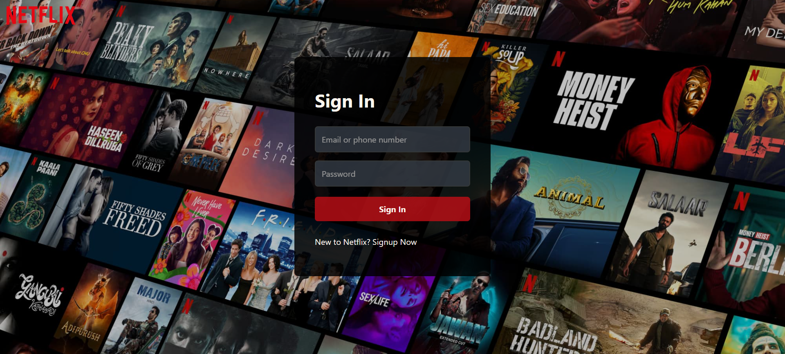

## NETFLIX-PLUS
  
 DEMO LINK - https://www.awesomescreenshot.com/video/25102509?key=a3468d7a0d35f05ac2bb4c7090059371
 
  
  
 

 ## Features (PLANNING)
 - Browse Route after authentication (LOGGED IN) 
    - Header
    - Background Movie Playing (Main Movie)
        - Trailer in Background
        - Title and Description

        - Movie Suggestions
            - Movie Lists * N

 - When LOGGED OUT
    - Home Page '/' route
    - Signup / Signip Page along with button
        - Sign In / Sign Up form
        - redirect to Browse Page

 - NetflixPlus (GPT API)
    - Search Bar
    - Movie Suggestions

 ## STEPS
    - Create React App
    - Configured TailwindCSS
    - Header
    - Routing
    - Login/SignIn Form
    - Signup Form
    - Form Validation (Regex) && Use Ref Hook
    - Firebase Setup & Deploying our app to Production
    - Create SignUp user account && SignIn using Firebase
    - Push the USER info into Redux Store
    - Implemented Signout
    - Display Name
    - Get Data from TMDB api Lists
    - Movie Trailer with Title and Description

 ## REACT - REDUX (A BRIEF UNDERSTANDING)
    $npm install --save redux react-redux

    Difficult to give states (Names,Address, ProdilePic..etc) to severalcomponents in bigger application when we need. It creates a global state for the whole application, that can be accessed by any of your component. It is a state management library

    Shop               Shopkeeper    Customer
    States Store <---> Reducer <---> Action
    
    store: it brings the actions and reducers together, holding and changing the state for the whole app — there is only one store.

    reducers: these are functions that implement the behavior of the actions. They change the state of the app, based on the action description and the state change description.

    actions: these are objects that should have two properties, one describing the type of action, and one describing what should be changed in the app state.  

    createStore() -> accepts param xyz reducer
    getState() -> method to give access to state it holds
    dispatch(action) -> method allow state to be updated
    subscribe(listener) -> method by which we can register listeners. This method accept function listeners as a parameter which execute anytime when the state in redux changes. 

    <Provider store={}>App<Provider/> -> connect our app with Redux and pass any store to it as a prop

    Hooks + React Redux -> useSelector Hook - access states from store. It accepts selector fn as a params, which accepts the state a argumant and returns a value.

    Hooks + React Redux -> useDispatch Hook - returns a reference to the dispatch function from redux store. 
